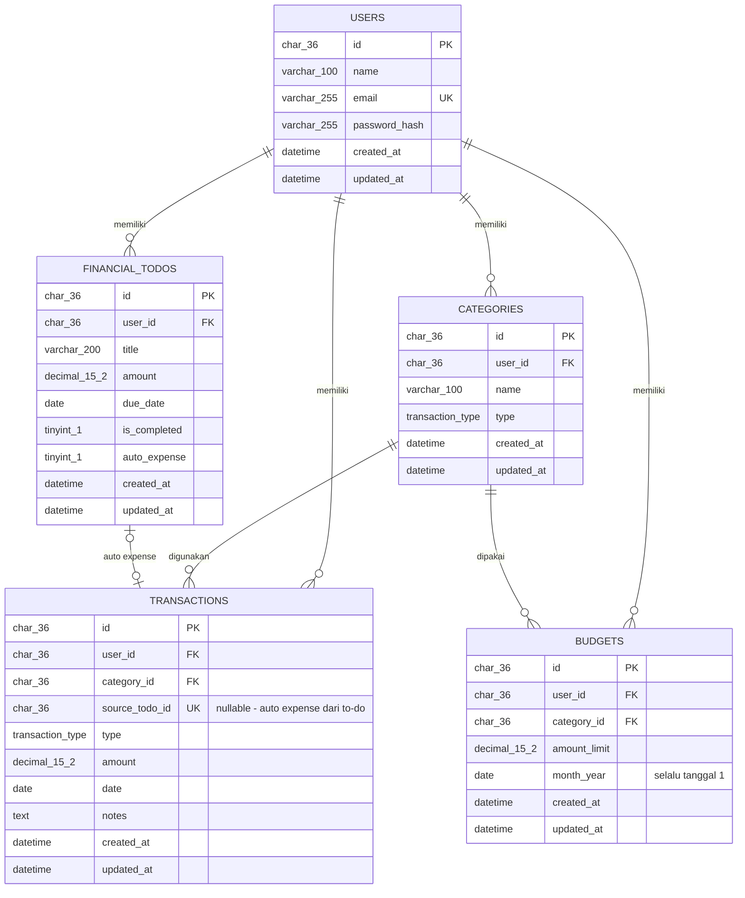

# FINTRACK

Aplikasi catat keuangan pribadi berbasis web dengan konsep **To-Do List Finansial** — catat transaksi, atur budget bulanan, dan selesaikan kewajiban keuangan lewat checklist.

> Proyek Capstone Project — STSI4440 — Universitas Terbuka (Kelompok B)
> Live: https://financialtracking.online/

## Fitur

- **Autentikasi** — register, login (JWT HttpOnly), ganti password, hapus akun
- **Transaksi** — catat pemasukan/pengeluaran per kategori, riwayat + filter + pencarian
- **Kategori** — pengelompokan transaksi (pemasukan & pengeluaran)
- **Budget bulanan** — per kategori, progress bar, peringatan 80% / 100%
- **Financial To-Do** — checklist kewajiban keuangan, opsi *auto expense* (selesai → transaksi tercatat otomatis)
- **Dashboard** — saldo, grafik 6 bulan, pengeluaran per kategori, to-do terdekat

## Teknologi

| Bagian | Teknologi |
| :--- | :--- |
| Frontend | React 18 + Vite + Tailwind CSS |
| Backend | PHP 8.1+ (API JSON, tanpa framework) |
| Database | MySQL/MariaDB (hosting) · SQLite (development lokal) |
| Auth | JWT HS256 + bcrypt, cookie HttpOnly |

## Struktur

```
frontend/            → aplikasi React (source + hasil build)
backend-php/         → API PHP (router, endpoint, skema SQL)
backend-php/api/     → kode API
backend-php/sql/     → skema database
deploy-fintrack.zip  → paket deploy siap upload ke hosting
```

## Menjalankan di Lokal (tanpa MySQL/Laragon)

1. Siapkan PHP 8.1+ dengan ekstensi `pdo_sqlite`
2. Jalankan API:
   ```
   php -S 127.0.0.1:3000 -t backend-php backend-php/router-dev.php
   ```
   Database SQLite (`database/fintrack.sqlite`) dibuat otomatis.
3. Jalankan frontend:
   ```
   cd frontend && npm install && npm run dev
   ```
4. Buka http://localhost:5173

## Deploy ke Hosting (cPanel)

1. Jalankan `backend-php/schema-hosting.sql` lewat phpMyAdmin (sekali saja)
2. Upload isi `backend-php/deploy-stage/` + hasil build frontend ke folder domain
3. Buka `install.php?key=<kunci>` sekali untuk membuat tabel, lalu hapus file-nya
4. Detail lengkap: `backend-php/README-deploy.txt`

## Dokumentasi

Dokumen lengkap (PRD, ERD, Business Rules, API, pengujian) ada di repositori internal kelompok.

## Struktur Database (ERD)



Detail relasi & business rules: lihat `fintrack.md` (Bagian 10 & 35).
